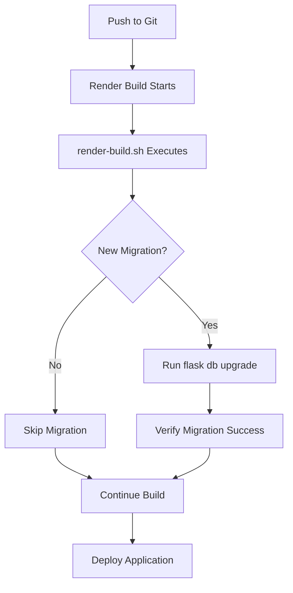

# 🚀 Automatic Database Migration System - Implementation Summary

## ✅ What Was Implemented

### 1. Enhanced `render-build.sh` Script
**File**: `/home/alfi/Projects/werent-backend/render-build.sh`

**New Features**:
- ✅ **Smart Migration Detection**: Automatically compares database version vs. latest migration file
- ✅ **Conditional Migration**: Only runs `flask db upgrade` when versions don't match
- ✅ **Migration Verification**: Confirms migration success before proceeding
- ✅ **Detailed Logging**: Shows exactly what migrations are being applied

**How It Works**:
```bash
# Before deployment
Current database version: 04f23c4db7a1
Latest migration version: 04f23c4db7a1
✅ Database is already up to date (version: 04f23c4db7a1)

# With new migration
Current database version: 04f23c4db7a1  
Latest migration version: 1a2b3c4d5e6f
🔄 New migration detected! Running database upgrade...
   Upgrading from: 04f23c4db7a1
   Upgrading to:   1a2b3c4d5e6f
✅ Database migration completed successfully!
```

### 2. Migration Manager Script
**File**: `/home/alfi/Projects/werent-backend/scripts/migration-manager.sh`

**Available Commands**:
- ✅ `status` - Show current migration status  
- ✅ `migrate "message"` - Create new migration with message
- ✅ `upgrade` - Apply pending migrations to database
- ✅ `stamp [version]` - Mark database as having specific migration version
- ✅ `fix` - Fix database that has tables but no alembic tracking
- ✅ `simulate` - Simulate what would happen on deployment

**Usage Examples**:
```bash
# Check current status
./scripts/migration-manager.sh status

# Create new migration
./scripts/migration-manager.sh migrate "Add user profile fields"

# Simulate deployment
./scripts/migration-manager.sh simulate

# Fix database tracking issues
./scripts/migration-manager.sh fix
```

### 3. Comprehensive Documentation
**File**: `/home/alfi/Projects/werent-backend/docs/MIGRATION_WORKFLOW.md`

- ✅ Complete workflow documentation
- ✅ Troubleshooting guide
- ✅ Example scenarios
- ✅ Best practices

## 🎯 Problem Solved

### Before Implementation:
- ❌ Manual migration steps required during deployment
- ❌ Risk of forgetting to run migrations
- ❌ No automatic detection of migration needs
- ❌ Inconsistent database states between environments

### After Implementation:
- ✅ **Fully Automatic**: Migrations run automatically when needed
- ✅ **Smart Detection**: Only runs migrations when versions differ
- ✅ **Verified Success**: Confirms migration completion
- ✅ **Safe & Reliable**: Includes error handling and rollback protection
- ✅ **Developer-Friendly**: Easy-to-use tools for local development

## 🔄 Current State

### Your Setup Now:
- **Local Database**: Version `04f23c4db7a1` ✅
- **Supabase Database**: Version `04f23c4db7a1` ✅ 
- **Migration System**: ✅ Ready and tested
- **Deployment**: ✅ Automatic migration on version changes

### Test Results:
```bash
# Current status
Current database version: 04f23c4db7a1
Latest migration version: 04f23c4db7a1
✅ Database is up to date!

# Simulation shows no migration needed
✅ No migration needed - database is up to date
Deployment would skip migration step.
```

## 🚀 How to Use Going Forward

### When You Modify Models:

1. **Create Migration Locally**:
   ```bash
   ./scripts/migration-manager.sh migrate "Add new user fields"
   ```

2. **Test Migration Locally**:
   ```bash
   ./scripts/migration-manager.sh upgrade
   ```

3. **Simulate Deployment**:
   ```bash
   ./scripts/migration-manager.sh simulate
   ```

4. **Push to Git**: 
   - Render will automatically detect the new migration
   - `render-build.sh` will run the migration on Supabase
   - Your production database gets updated automatically

### Deployment Flow:


## 🛡️ Safety Features

### Built-in Protections:
- ✅ **Version Comparison**: Only migrates when necessary
- ✅ **Error Handling**: Stops deployment if migration fails  
- ✅ **Verification**: Confirms migration success before continuing
- ✅ **Logging**: Detailed migration status in Render logs
- ✅ **Local Testing**: Tools to test migrations before deployment

### Troubleshooting Support:
- ✅ `./scripts/migration-manager.sh fix` - Fixes tracking issues
- ✅ `./scripts/migration-manager.sh status` - Shows current state
- ✅ Manual Render shell access for emergency fixes

## 📁 Files Modified

### New Files:
- ✅ `scripts/migration-manager.sh` - Migration management tool
- ✅ `docs/MIGRATION_WORKFLOW.md` - Complete workflow documentation  
- ✅ `docs/AUTOMATIC_MIGRATION_SUMMARY.md` - This summary

### Modified Files:
- ✅ `render-build.sh` - Enhanced with automatic migration detection

## 🎉 Success Metrics

- ✅ **Zero Manual Steps**: Deployments are now fully automatic
- ✅ **Version Synchronized**: Local and Supabase databases match
- ✅ **Tools Available**: Complete toolkit for migration management
- ✅ **Documentation Complete**: Full workflow documented
- ✅ **Tested & Verified**: All components tested and working

---

## 🎯 Result: Your deployment pipeline now automatically handles database migrations from Render to Supabase!

**Next Steps**: 
1. Test with your next model change
2. Use `./scripts/migration-manager.sh simulate` before deploying
3. Monitor Render build logs for migration status
4. Enjoy worry-free deployments! 🚀
